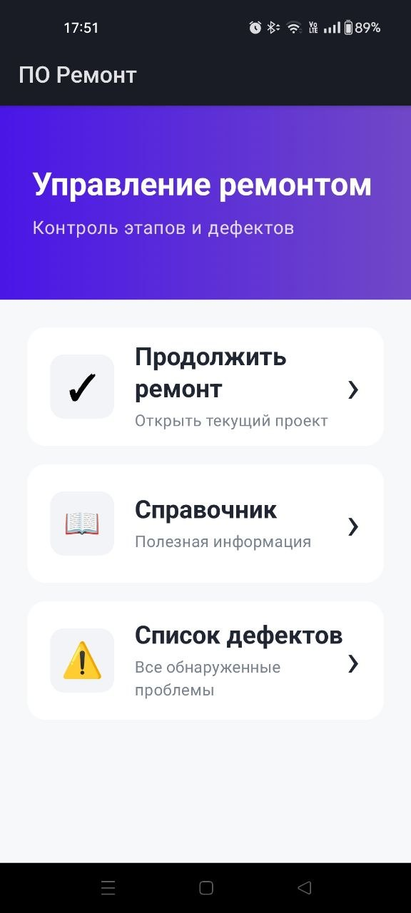
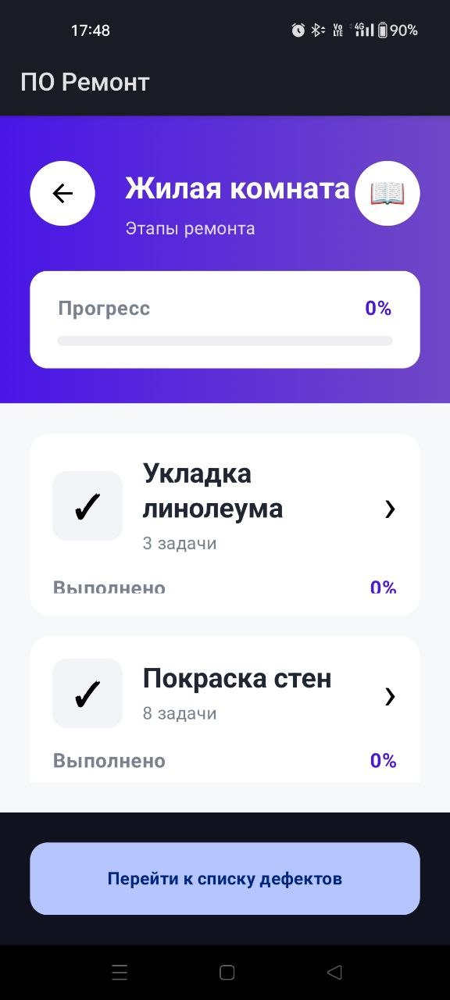
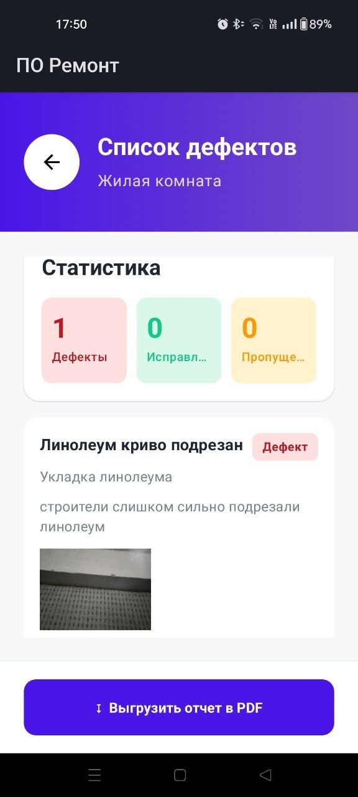
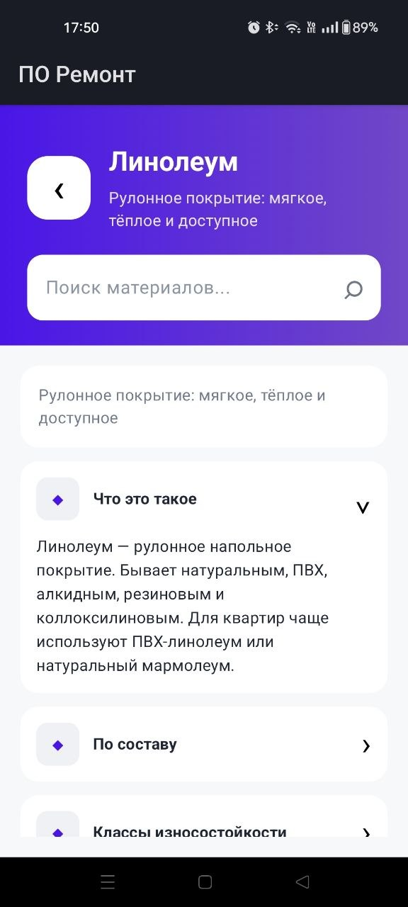

# ПО Ремонт — Android MVP для контроля качества ремонта

Мобильное приложение помогает контролировать ремонт по помещениям и этапам:
проходить чек-листы, фиксировать дефекты с фотографиями, отслеживать прогресс
и формировать PDF-отчёт.

Проект прошёл путь от требований и макетов до работающего Android MVP,
проверенного на физическом устройстве.

## Моя роль

В рамках проекта я:

- сформулировал назначение продукта и основные пользовательские сценарии;
- описал функциональные требования, бизнес-правила и критерии приёмки;
- спроектировал структуру помещений, этапов, проверок, дефектов и статусов;
- подготовил UI-макеты в Figma;
- сформировал backlog реализации;
- организовал AI-assisted разработку Android MVP;
- проводил функциональную проверку приложения на физическом устройстве;
- фиксировал найденные отклонения и принимал результат.

Я не позиционирую себя как Android-разработчика. Моя основная зона
ответственности в проекте — требования, проектирование решения,
контроль реализации и приёмка результата.

## Артефакты проекта

- [UI-макеты в Figma](https://www.figma.com/design/uCkXQ2gr3i9HrlidBwRAMK/)
- [Функциональные возможности](docs/FEATURES.md)
- [Структура Android-проекта](docs/PROJECT_STRUCTURE.md)
- Android MVP — текущий репозиторий

## Пользовательский сценарий

### Главный экран

Пользователь может продолжить текущий ремонт, открыть справочник
или перейти к общему списку найденных дефектов.

<p>
  
</p>

### Помещения, этапы и прогресс

Ремонт разделён на помещения и этапы. Для каждого этапа отображаются
задачи и процент выполнения.

<p>
  
</p>

### Чек-лист приёмки

Каждая проверка может завершиться одним из результатов:
успешно, пропущено или обнаружен дефект.

<p>
  
</p>

### Дефекты и отчётность

Дефект содержит описание, статус, связь с этапом и фотографию.
По результатам проверки можно сформировать PDF-отчёт.

<p>
  
</p>

### Встроенный справочник

Справочник материалов доступен локально и помогает проверять технологии
и свойства материалов без подключения к сети.

<p>
  
</p>

## Основные возможности

- создание проекта с набором помещений и этапов ремонта;
- пошаговые чек-листы с фиксацией результата проверки;
- регистрация дефектов, статусов, комментариев и фотографий;
- сводный прогресс по помещениям и этапам;
- общий список замечаний с фильтрацией;
- формирование PDF-отчёта;
- локальный справочник материалов и технологий;
- локальное хранение данных на устройстве.

## Статус проекта

Рабочий Android MVP проверен на физическом устройстве.

Реализованы основные пользовательские сценарии: создание и продолжение
проекта, выбор помещений и этапов, прохождение чек-листов, регистрация
дефектов, просмотр статистики, справочник и формирование PDF-отчёта.

Код создавался итеративно с использованием AI-инструментов.
Требования к поведению, проверка соответствия требованиям,
диагностика ошибок и приёмка результата выполнялись мной.

## Технологии

- Kotlin;
- Jetpack Compose и Material 3;
- Navigation Compose;
- Room и SharedPreferences для локального хранения;
- Android Activity Result API для камеры и выбора изображений;
- Coil для отображения фотографий;
- Android `PdfDocument` для формирования отчётов;
- Gradle Kotlin DSL и KSP.

## Требования

- JDK 17;
- Android SDK Platform 34;
- Android Studio с установленным Android SDK;
- устройство или эмулятор с Android 7.0 (API 24) или новее.

## Сборка

После клонирования откройте проект в Android Studio и дождитесь синхронизации Gradle. Если путь к SDK не определён автоматически, создайте локальный файл `local.properties`:

```properties
sdk.dir=C\:\\path\\to\\Android\\Sdk
```

Debug-сборка в Windows:

```powershell
.\gradlew.bat :app:assembleDebug
```

В macOS или Linux:

```bash
./gradlew :app:assembleDebug
```

APK будет создан в `app/build/outputs/apk/debug/`. Каталоги сборки, настройки среды разработки, локальный путь SDK и готовые пакеты исключены из Git.

## Документация

- [Структура проекта](docs/PROJECT_STRUCTURE.md)
- [Функциональные возможности](docs/FEATURES.md)

## Хранение данных

Проект, результаты проверок, дефекты и фотографии сохраняются локально. Каталог справочных материалов поставляется вместе с приложением в `app/src/main/assets/reference/materials.json`.
